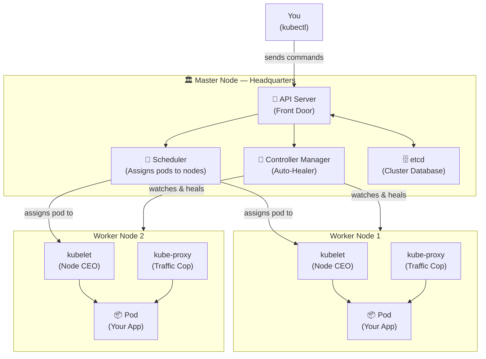
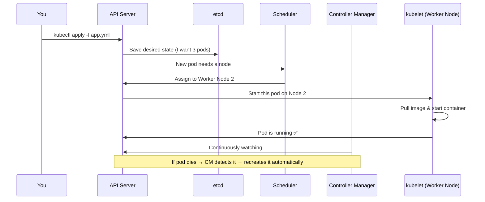
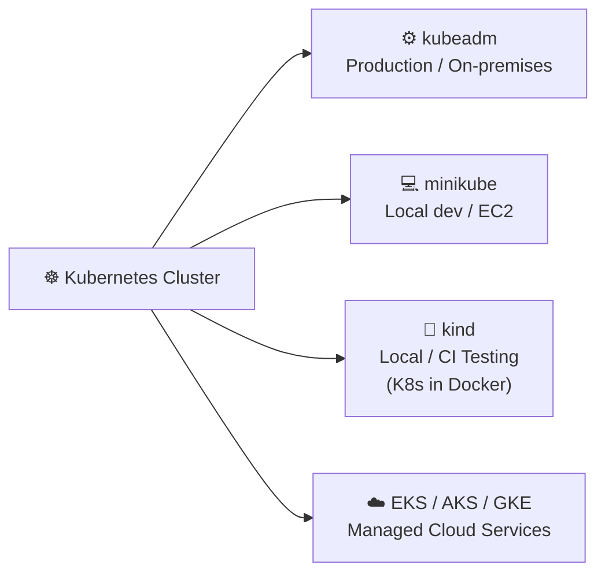
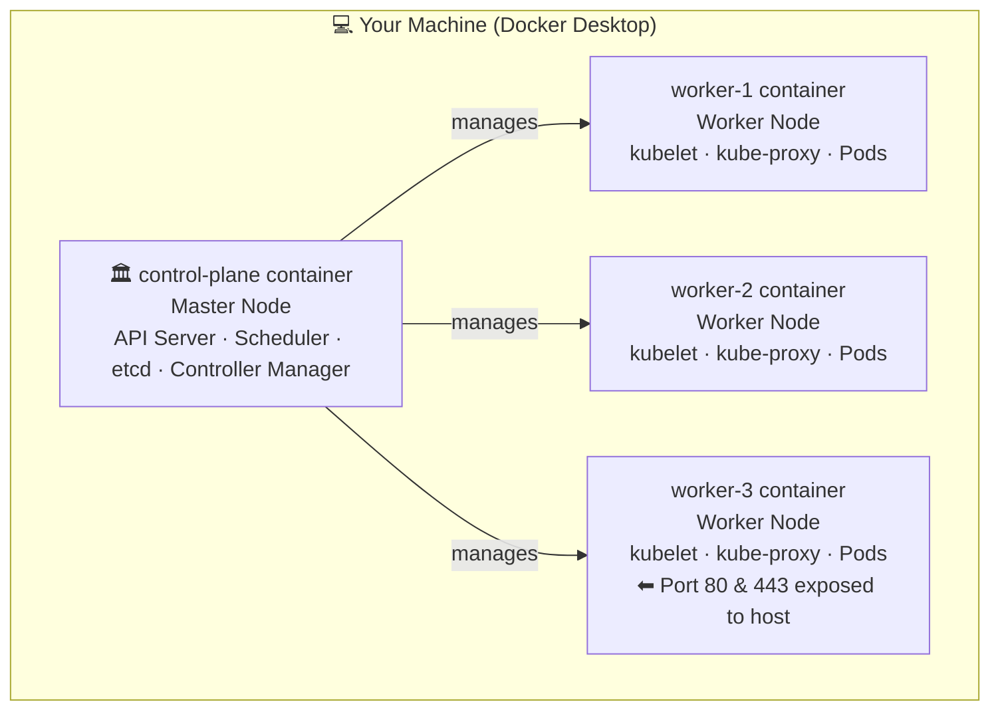
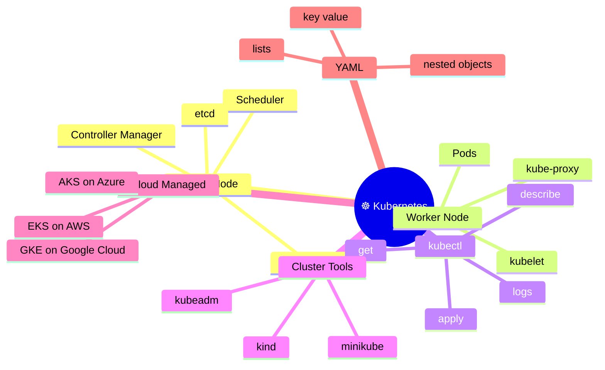

# Kubernetes — Complete Beginner's Guide
 
---
 
## What is Kubernetes?
 
**Kubernetes** (short: **K8s**) is an open-source tool that **automatically manages containers** — it starts them, stops them, restarts them if they crash, and scales them when needed.
 
> You tell Kubernetes *what* you want running. It figures out *how* and *where* to run it.
 
---
 
## Why Use Kubernetes?
 
| Without Kubernetes                     | With Kubernetes                           |
| -------------------------------------- | ----------------------------------------- |
| App crashes → manual restart needed    | Auto-restarts crashed containers          |
| Traffic spike → app slows down         | Auto-scales containers up or down         |
| Deploying updates causes downtime      | Zero-downtime rolling updates             |
| 10 servers are hard to manage manually | Manages all servers as one system         |
| Container networking is complex        | Built-in networking and service discovery |
 
---
 
## Core Concepts (Simple Analogies)
 
```
Node          =  A single server (machine)
Cluster       =  Group of servers working together
Master Node   =  Headquarters — the brain, makes all decisions
Worker Node   =  Soldiers — actually run your applications
```
 
---
 
## Architecture Diagram
 

 
---
 
## Component Definitions
 
### 🚪 API Server
- The **front door** of Kubernetes.
- Every request (from `kubectl`, dashboards, or internal components) goes here first.
- It validates requests and stores changes into `etcd`.
- **Analogy:** The *receptionist at HQ* — receives, checks, and passes on all commands.
 
---
 
### 🔁 Controller Manager
- Runs background loops that **constantly watch** the cluster.
- If something is wrong (pod died, node offline), it takes action to fix it.
- Ensures the **desired state** always matches the **actual state**.
- **Analogy:** The *supervisor* who checks if all soldiers are at their post and replaces anyone who falls.
 
---
 
### 📅 Scheduler
- Decides **which worker node** a new pod should run on.
- Looks at CPU, RAM, and other conditions on each node.
- Picks the best available node and tells `kubelet` there to start the pod.
- **Analogy:** The *HR manager* who assigns a new employee (pod) to the best-suited office (node).
 
---
 
### 👔 kubelet (= CEO of the Worker Node)
- Runs on **every worker node**.
- Receives orders from the Master Node and ensures containers are running correctly.
- Reports the health of the node and pods back to the master.
- **Analogy:** The *branch CEO* — takes orders from HQ and makes sure the local team (containers) does their job.
 
---
 
### 🚦 Service Proxy (kube-proxy)
- Runs on **every worker node**.
- Manages all **network traffic rules** on the node.
- Routes requests to the correct pod — inside or outside the cluster.
- **Analogy:** A *traffic cop* at every intersection, directing packets to the right destination.
 
---
 
### 🗄️ etcd
- A **key-value database** that stores the entire cluster state.
- Every pod config, node info, secret, and rule lives here.
- It is the **single source of truth** for Kubernetes.
- **Analogy:** The *filing cabinet at HQ* — all important records are stored here.
 
---
 
### ⌨️ kubectl
- The **command-line tool** you use to talk to Kubernetes.
- You type commands; `kubectl` sends them to the API Server.
- **Analogy:** Your *phone line to HQ* — you give orders and get status back through it.
 
---
 
## How It All Works (Request Flow)
 

 
---
 
## Ways to Create a Kubernetes Cluster
 

 
| Tool         | Best For               | Notes                             |
| ------------ | ---------------------- | --------------------------------- |
| **kubeadm**  | Production, bare-metal | Sets up a real multi-node cluster |
| **minikube** | Local laptop or EC2    | Single-node, great for learning   |
| **kind**     | Local testing / CI     | Runs nodes as Docker containers   |
| **EKS**      | AWS                    | Amazon's managed K8s              |
| **AKS**      | Azure                  | Microsoft's managed K8s           |
| **GKE**      | Google Cloud           | Google's managed K8s              |
 
---
 
## YAML Basics (Kubernetes Uses YAML)
 
YAML = human-readable config language. Three things to know:
 
```
key: value       →  simple pair
- item           →  list item
  child: value   →  indentation = nesting (use SPACES, never tabs!)
```
 
### demo.yml — Examples
 
**Simple key-value:**
```yaml
key: value
name: amit
```
 
**List:**
```yaml
departments:
  - hr
  - finance
  - it
  - marketing
  - sales
```
 
**Nested object:**
```yaml
info:
  name: amit
  age: 25
  gender: male
  address:
    city: hyderabad
    state: telangana
  jobs:
    - software engineer
    - data scientist
    - machine learning engineer
```
 
---
 
## Creating a Kind Cluster — Step by Step
 
### Step 1 — Create a directory and config file
 
```bash
mkdir kind-cluster
cd kind-cluster
vim config.yml
```
 
### Step 2 — Write the cluster config
 
```yaml
# config.yml
 
kind: Cluster
apiVersion: kind.x-k8s.io/v1alpha4
nodes:
  - role: control-plane
    image: kindest/node:v1.31.2
  - role: worker
    image: kindest/node:v1.31.2
  - role: worker
    image: kindest/node:v1.31.2
  - role: worker
    image: kindest/node:v1.31.2
    extraPortMappings:
      - containerPort: 80
        hostPort: 80
        protocol: TCP
      - containerPort: 443
        hostPort: 443
        protocol: TCP
```
 
### Kind Cluster Diagram
 

 
### Step 3 — Create the cluster
 
```bash
kind create cluster --name=tws-cluster --config=config.yml
```
 
### Step 4 — Verify it's working
 
```bash
# Check cluster connection info
kubectl cluster-info --context kind-tws-cluster
 
# List all nodes in the cluster
kubectl get nodes
```
 
**Expected output of `kubectl get nodes`:**
```
NAME                       STATUS   ROLES           AGE
tws-cluster-control-plane  Ready    control-plane   1m
tws-cluster-worker         Ready    <none>          1m
tws-cluster-worker2        Ready    <none>          1m
tws-cluster-worker3        Ready    <none>          1m
```
 
---
 
## minikube Directory Setup
 
```bash
mkdir minikube
cd minikube
 
# Start a local single-node cluster
minikube start
 
# Check status
minikube status
 
# Open dashboard in browser
minikube dashboard
```
 
---
 
## kubectl Quick Reference
 
```bash
# Cluster info
kubectl cluster-info
kubectl get nodes
 
# Pods
kubectl get pods
kubectl get pods -A                   # all namespaces
kubectl describe pod <pod-name>       # detailed info
kubectl logs <pod-name>               # view logs
kubectl exec -it <pod-name> -- sh     # enter container shell
 
# Deploy & manage
kubectl apply -f file.yml             # create/update from YAML
kubectl delete -f file.yml            # remove resources
kubectl get all                       # see everything running
```
 
---
 
## Everything in One Mind Map
 

 
---
 
## Summary Table
 
| Concept            | Analogy          | Job                             |
| ------------------ | ---------------- | ------------------------------- |
| Cluster            | City             | All nodes working as one        |
| Node               | Server / Machine | One computer in the cluster     |
| Master Node        | Headquarters     | Controls the whole cluster      |
| Worker Node        | Soldier          | Runs the actual apps            |
| Pod                | Room             | Smallest unit, holds containers |
| API Server         | Receptionist     | Entry point for all commands    |
| etcd               | Filing Cabinet   | Stores all cluster data         |
| Scheduler          | HR Assigner      | Decides which node runs a pod   |
| Controller Manager | Supervisor       | Keeps desired state matched     |
| kubelet            | Branch CEO       | Runs containers on a worker     |
| kube-proxy         | Traffic Cop      | Routes network traffic          |
| kubectl            | Phone to HQ      | CLI to send commands            |
 
---


# Kubernetes

what is kubernetes? 

why should need to use kubernetes?

node = server

multi node = cluster

master node = head quater

worker node = soldier

api server
cotroller manager
scheduler

kubelet = ceo

service proxy
etcd
kubectl

you need to write definitation of these concpet and serilies it and how it's works and draw diagram for it.


way to make kubernetes cluster

  kubeadm 
  minikube(local/ec2)
  kind cluster
  EKS/AKS/GKE

demo.yml

    key:value
    name: amit

    departments: 
        - hr
        - finance
        - it
        - marketing
        - sales

info: 
    name: amit
    age: 25
    gender: male
    address:
        city: hyderabad
        state: telangana
    jobs:
        - software engineer
        - data scientist
        - machine learning engineer
    
make kind cluster directory 

vim config.yml

kind: Cluster
apiVersion:
nodes: 
-role:control-plane
 image: kindes/node:v1.31.2
-role:control-plane
 image: kindes/node:v1.31.2
 -role:control-plane
 image: kindes/node:v1.31.2
 -role:control-plane
 image: kindes/node:v1.31.2
 extraPortMappings:
 -containerPort: 80
  hostPort: 80
  protocol: TCP
 -containerPort: 443
  protocol:TCP


create new kind cluster. 

  kind create cluster --name=tws-cluster --config=config.yml


kubectl cluster-info --context kind-tws-cluster

kubectl get nodes


makdir minikube


completed time 57 minutes. 

