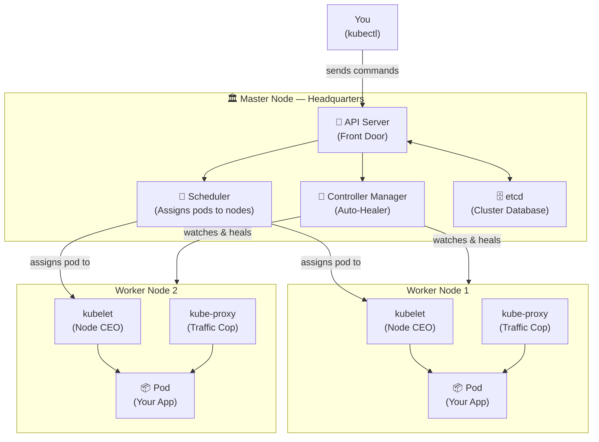
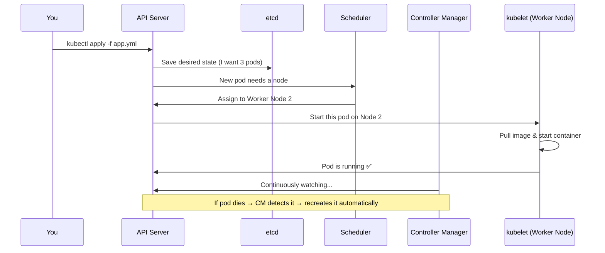
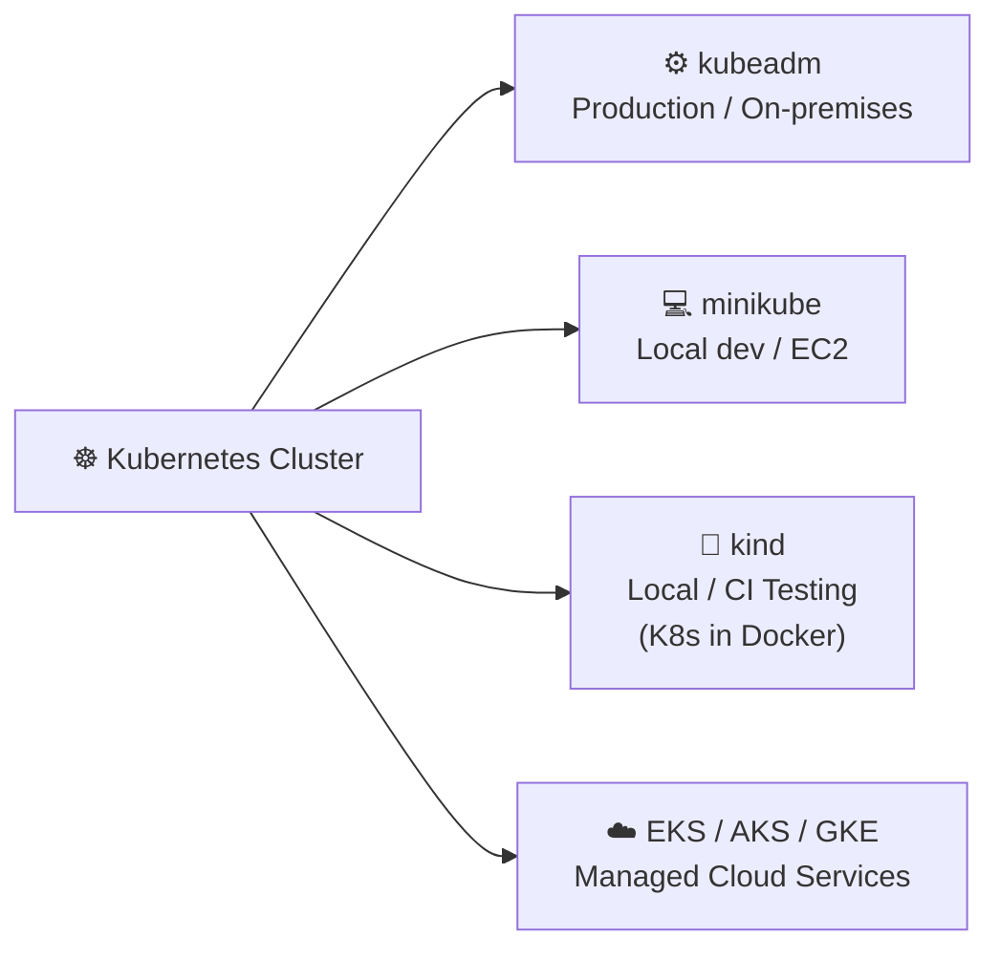
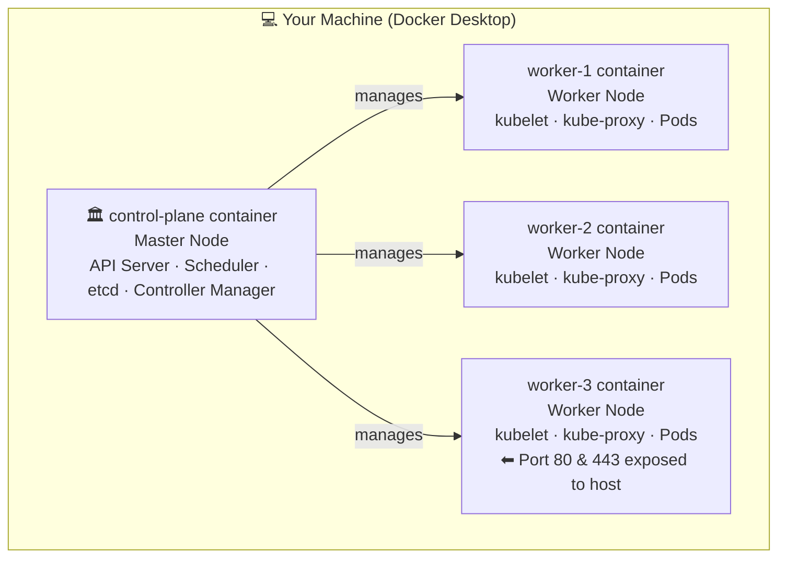
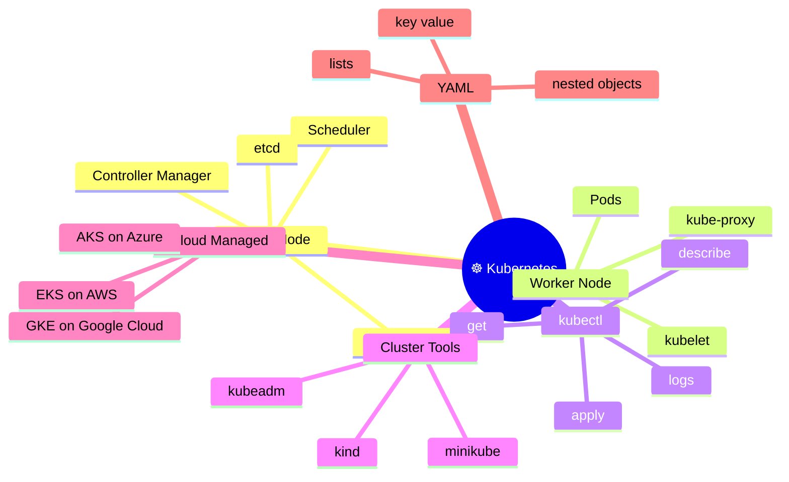

# Kubernetes — Complete Beginner's Guide
 
---
 
## What is Kubernetes?
 
**Kubernetes** (short: **K8s**) is an open-source tool that **automatically manages containers** — it starts them, stops them, restarts them if they crash, and scales them when needed.
 
> You tell Kubernetes *what* you want running. It figures out *how* and *where* to run it.
 
---
 
## Why Use Kubernetes?
 
| Without Kubernetes                     | With Kubernetes                           |
| -------------------------------------- | ----------------------------------------- |
| App crashes → manual restart needed    | Auto-restarts crashed containers          |
| Traffic spike → app slows down         | Auto-scales containers up or down         |
| Deploying updates causes downtime      | Zero-downtime rolling updates             |
| 10 servers are hard to manage manually | Manages all servers as one system         |
| Container networking is complex        | Built-in networking and service discovery |
 
---
 
## Core Concepts (Simple Analogies)
 
```
Node          =  A single server (machine)
Cluster       =  Group of servers working together
Master Node   =  Headquarters — the brain, makes all decisions
Worker Node   =  Soldiers — actually run your applications
```
 
---
 
## Architecture Diagram
 

 
---
 
## Component Definitions
 
### 🚪 API Server
- The **front door** of Kubernetes.
- Every request (from `kubectl`, dashboards, or internal components) goes here first.
- It validates requests and stores changes into `etcd`.
- **Analogy:** The *receptionist at HQ* — receives, checks, and passes on all commands.
 
---
 
### 🔁 Controller Manager
- Runs background loops that **constantly watch** the cluster.
- If something is wrong (pod died, node offline), it takes action to fix it.
- Ensures the **desired state** always matches the **actual state**.
- **Analogy:** The *supervisor* who checks if all soldiers are at their post and replaces anyone who falls.
 
---
 
### 📅 Scheduler
- Decides **which worker node** a new pod should run on.
- Looks at CPU, RAM, and other conditions on each node.
- Picks the best available node and tells `kubelet` there to start the pod.
- **Analogy:** The *HR manager* who assigns a new employee (pod) to the best-suited office (node).
 
---
 
### 👔 kubelet (= CEO of the Worker Node)
- Runs on **every worker node**.
- Receives orders from the Master Node and ensures containers are running correctly.
- Reports the health of the node and pods back to the master.
- **Analogy:** The *branch CEO* — takes orders from HQ and makes sure the local team (containers) does their job.
 
---
 
### 🚦 Service Proxy (kube-proxy)
- Runs on **every worker node**.
- Manages all **network traffic rules** on the node.
- Routes requests to the correct pod — inside or outside the cluster.
- **Analogy:** A *traffic cop* at every intersection, directing packets to the right destination.
 
---
 
### 🗄️ etcd
- A **key-value database** that stores the entire cluster state.
- Every pod config, node info, secret, and rule lives here.
- It is the **single source of truth** for Kubernetes.
- **Analogy:** The *filing cabinet at HQ* — all important records are stored here.
 
---
 
### ⌨️ kubectl
- The **command-line tool** you use to talk to Kubernetes.
- You type commands; `kubectl` sends them to the API Server.
- **Analogy:** Your *phone line to HQ* — you give orders and get status back through it.
 
---
 
## How It All Works (Request Flow)
 

 
---
 
## Ways to Create a Kubernetes Cluster
 

 
| Tool         | Best For               | Notes                             |
| ------------ | ---------------------- | --------------------------------- |
| **kubeadm**  | Production, bare-metal | Sets up a real multi-node cluster |
| **minikube** | Local laptop or EC2    | Single-node, great for learning   |
| **kind**     | Local testing / CI     | Runs nodes as Docker containers   |
| **EKS**      | AWS                    | Amazon's managed K8s              |
| **AKS**      | Azure                  | Microsoft's managed K8s           |
| **GKE**      | Google Cloud           | Google's managed K8s              |
 
---
 
## YAML Basics (Kubernetes Uses YAML)
 
YAML = human-readable config language. Three things to know:
 
```
key: value       →  simple pair
- item           →  list item
  child: value   →  indentation = nesting (use SPACES, never tabs!)
```
 
### demo.yml — Examples
 
**Simple key-value:**
```yaml
key: value
name: amit
```
 
**List:**
```yaml
departments:
  - hr
  - finance
  - it
  - marketing
  - sales
```
 
**Nested object:**
```yaml
info:
  name: amit
  age: 25
  gender: male
  address:
    city: hyderabad
    state: telangana
  jobs:
    - software engineer
    - data scientist
    - machine learning engineer
```
 
---
 
## Creating a Kind Cluster — Step by Step
 
### Step 1 — Create a directory and config file
 
```bash
mkdir kind-cluster
cd kind-cluster
vim config.yml
```
 
### Step 2 — Write the cluster config
 
```yaml
# config.yml
 
kind: Cluster
apiVersion: kind.x-k8s.io/v1alpha4
nodes:
  - role: control-plane
    image: kindest/node:v1.31.2
  - role: worker
    image: kindest/node:v1.31.2
  - role: worker
    image: kindest/node:v1.31.2
  - role: worker
    image: kindest/node:v1.31.2
    extraPortMappings:
      - containerPort: 80
        hostPort: 80
        protocol: TCP
      - containerPort: 443
        hostPort: 443
        protocol: TCP
```
 
### Kind Cluster Diagram
 

 
### Step 3 — Create the cluster
 
```bash
kind create cluster --name=tws-cluster --config=config.yml
```
 
### Step 4 — Verify it's working
 
```bash
# Check cluster connection info
kubectl cluster-info --context kind-tws-cluster
 
# List all nodes in the cluster
kubectl get nodes
```
 
**Expected output of `kubectl get nodes`:**
```
NAME                       STATUS   ROLES           AGE
tws-cluster-control-plane  Ready    control-plane   1m
tws-cluster-worker         Ready    <none>          1m
tws-cluster-worker2        Ready    <none>          1m
tws-cluster-worker3        Ready    <none>          1m
```
 
---
 
## minikube Directory Setup
 
```bash
mkdir minikube
cd minikube
 
# Start a local single-node cluster
minikube start
 
# Check status
minikube status
 
# Open dashboard in browser
minikube dashboard
```
 
---
 
## kubectl Quick Reference
 
```bash
# Cluster info
kubectl cluster-info
kubectl get nodes
 
# Pods
kubectl get pods
kubectl get pods -A                   # all namespaces
kubectl describe pod <pod-name>       # detailed info
kubectl logs <pod-name>               # view logs
kubectl exec -it <pod-name> -- sh     # enter container shell
 
# Deploy & manage
kubectl apply -f file.yml             # create/update from YAML
kubectl delete -f file.yml            # remove resources
kubectl get all                       # see everything running
```
---

## 1. Installing Minikube

Minikube is a lightweight Kubernetes implementation that runs a single-node cluster inside a VM or container on your local machine. It is primarily used for local development and testing.

### Step 1: Install Prerequisites

```bash
sudo apt install -y curl wget apt-transport-https
```

| Package               | Purpose                                      |
| --------------------- | -------------------------------------------- |
| `curl`                | Command-line tool to transfer data from URLs |
| `wget`                | Alternative download utility                 |
| `apt-transport-https` | Allows `apt` to fetch packages over HTTPS    |

### Step 2: Download the Minikube Binary

```bash
curl -LO "https://storage.googleapis.com/minikube/releases/latest/minikube-linux-amd64"
```

**Flags explained:**
- `-L` — Follow redirects (important if the URL redirects to a CDN)
- `-O` — Save the file with its original filename (`minikube-linux-amd64`)

This downloads the latest stable Minikube binary for 64-bit Linux from Google Cloud Storage.

### Step 3: Install the Binary

```bash
sudo install minikube-linux-amd64 /usr/local/bin/minikube
```

This moves and sets proper executable permissions on the binary, placing it at `/usr/local/bin/minikube`. This path is included in the system's `$PATH` by default, so you can run `minikube` from anywhere in the terminal.

> **Alternative (manual):**
> ```bash
> chmod +x minikube-linux-amd64
> sudo mv minikube-linux-amd64 /usr/local/bin/minikube
> ```

### Step 4: Verify the Installation

```bash
minikube version
```

**Expected output:**
```
minikube version: v1.33.x
commit: abc123...
```

This confirms Minikube is installed correctly at `/usr/local/bin/minikube` and is accessible system-wide.

> **Tip:** For the most up-to-date installation instructions, search **"minikube installation"** on Google and visit the [official Minikube documentation](https://minikube.sigs.k8s.io/docs/).

---

## 2. Starting Minikube

```bash
minikube start --driver=docker --vm=true
```

**Flags explained:**

| Flag              | Description                                                                                          |
| ----------------- | ---------------------------------------------------------------------------------------------------- |
| `--driver=docker` | Uses Docker as the underlying virtualization/container driver instead of VirtualBox or KVM           |
| `--vm=true`       | Instructs Minikube to use a virtual machine layer (even on top of Docker), ensuring better isolation |

**What happens behind the scenes:**
- Minikube pulls a base image (e.g., `gcr.io/k8s-minikube/kicbase`)
- A Docker container or VM is created to host the Kubernetes control plane
- `kubectl` context is automatically configured to point to this cluster
- Core Kubernetes components (`kube-apiserver`, `etcd`, `kube-scheduler`, `kube-controller-manager`, `CoreDNS`) are started inside the node

---

## 3. Setting Up a Multi-Node Cluster with kubeadm

`kubeadm` is the official Kubernetes tool used to bootstrap a production-grade cluster. Unlike Minikube, it sets up a real multi-node cluster.

### 3.1 — Execute on BOTH Master and Worker Nodes

#### Disable Swap

```bash
sudo swapoff -a
```

**Why is swap disabled?**

Kubernetes requires swap to be disabled because:
- The Kubernetes scheduler makes decisions about pod placement based on **available memory**. If swap is enabled, the scheduler's memory calculations become unreliable.
- Swap causes unpredictable **latency spikes** — when the kernel swaps memory to disk, containers experience sudden slowdowns.
- Kubernetes' OOM (Out Of Memory) killer behavior becomes inconsistent when swap is active.
- The `kubelet` (Kubernetes node agent) will **refuse to start** unless swap is off (or explicitly configured to allow it in newer versions).

> **Make it permanent** (survives reboot): Edit `/etc/fstab` and comment out any swap entries.

#### Load Necessary Kernel Modules for Kubernetes Networking

```bash
cat <<EOF | sudo tee /etc/modules-load.d/k8s.conf
overlay
br_netfilter
EOF

sudo modprobe overlay
sudo modprobe br_netfilter
```

**Why these modules?**

| Module         | Purpose                                                                                                                                              |
| -------------- | ---------------------------------------------------------------------------------------------------------------------------------------------------- |
| `overlay`      | Required by container runtimes (like containerd) for OverlayFS — the union filesystem used to layer container images                                 |
| `br_netfilter` | Enables the Linux kernel to pass bridged (Layer 2) traffic through `iptables` rules, which is essential for pod-to-pod and pod-to-service networking |

#### Set sysctl Parameters for Kubernetes Networking

```bash
cat <<EOF | sudo tee /etc/sysctl.d/k8s.conf
net.bridge.bridge-nf-call-iptables  = 1
net.bridge.bridge-nf-call-ip6tables = 1
net.ipv4.ip_forward                 = 1
EOF

sudo sysctl --system
```

**Why these settings?**

| Parameter                                 | Purpose                                                                                                                          |
| ----------------------------------------- | -------------------------------------------------------------------------------------------------------------------------------- |
| `net.bridge.bridge-nf-call-iptables = 1`  | Ensures bridged IPv4 traffic is processed by iptables — required for kube-proxy and network policies                             |
| `net.bridge.bridge-nf-call-ip6tables = 1` | Same as above but for IPv6 traffic                                                                                               |
| `net.ipv4.ip_forward = 1`                 | Enables the node to forward IP packets between network interfaces (acts as a router), essential for routing traffic between pods |

#### Install containerd (Container Runtime)

```bash
sudo apt-get update
sudo apt-get install -y containerd
sudo mkdir -p /etc/containerd
containerd config default | sudo tee /etc/containerd/config.toml
sudo systemctl restart containerd
sudo systemctl enable containerd
```

**What is containerd?**

`containerd` is a high-performance, industry-standard container runtime. Kubernetes uses it via the **CRI (Container Runtime Interface)** to pull images, start containers, and manage their lifecycle. It replaced Docker as the default runtime in Kubernetes 1.24+.

#### Install Kubernetes Components

```bash
sudo apt-get update
sudo apt-get install -y apt-transport-https ca-certificates curl
curl -fsSL https://pkgs.k8s.io/core:/stable:/v1.29/deb/Release.key | sudo gpg --dearmor -o /etc/apt/keyrings/kubernetes-apt-keyring.gpg
echo 'deb [signed-by=/etc/apt/keyrings/kubernetes-apt-keyring.gpg] https://pkgs.k8s.io/core:/stable:/v1.29/deb/ /' | sudo tee /etc/apt/sources.list.d/kubernetes.list
sudo apt-get update
sudo apt-get install -y kubelet kubeadm kubectl
sudo apt-mark hold kubelet kubeadm kubectl
```

| Component | Role                                                                                                                |
| --------- | ------------------------------------------------------------------------------------------------------------------- |
| `kubelet` | The primary node agent that runs on every node. It ensures containers described in PodSpecs are running and healthy |
| `kubeadm` | The cluster bootstrapping tool — used to initialize the master and join worker nodes                                |
| `kubectl` | The command-line interface for interacting with the Kubernetes API                                                  |

> `apt-mark hold` prevents these packages from being accidentally upgraded, which could cause version mismatches in a cluster.

---

### 3.2 — Execute ONLY on the Master Node

#### Initialize the Cluster

```bash
sudo kubeadm init --pod-network-cidr=192.168.0.0/16
```

#### Setup Local kubeconfig

```bash
mkdir -p $HOME/.kube
sudo cp -i /etc/kubernetes/admin.conf $HOME/.kube/config
sudo chown $(id -u):$(id -g) $HOME/.kube/config
```

**Why is this needed?**

`kubectl` reads cluster connection details (API server address, credentials, certificates) from a **kubeconfig file**, located at `~/.kube/config` by default. The `admin.conf` file generated by `kubeadm init` contains the cluster admin credentials. Copying it to `~/.kube/config` lets you run `kubectl` as your normal user without `sudo`.

#### Install a Network Plugin (Calico)

```bash
kubectl apply -f https://raw.githubusercontent.com/projectcalico/calico/v3.26.0/manifests/calico.yaml
```

**Why is a network plugin required?**

Kubernetes does **not** ship with a built-in network solution. It defines a standard called **CNI (Container Network Interface)**, and you must install a CNI plugin before pods can communicate. Calico is one of the most popular options:
- Implements the Kubernetes **NetworkPolicy** API for fine-grained traffic control
- Uses **BGP (Border Gateway Protocol)** for scalable routing
- Provides both network connectivity and network security

Other popular options: Flannel, Weave, Cilium.

#### Generate the Join Command

```bash
kubeadm token create --print-join-command
```

This generates a command that worker nodes will use to join the cluster. It contains a bootstrap token and the SHA256 hash of the CA certificate for verification. Example output:

```
kubeadm join 192.168.1.100:6443 --token abc123.xyz456 \
  --discovery-token-ca-cert-hash sha256:abcdef1234...
```

#### Watch Nodes Join

```bash
watch kubectl get nodes
```

`watch` re-runs the command every 2 seconds. You'll see nodes transition from `NotReady` → `Ready` as the CNI plugin and kubelet finish initializing.

---

### 3.3 — Execute on Each Worker Node

```bash
# Run the join command generated in the previous step:
sudo kubeadm join <master-ip>:6443 --token <token> \
  --discovery-token-ca-cert-hash sha256:<hash>
```

**Pre-flight checks performed automatically:**

Before joining, `kubeadm` validates:
- The node meets minimum resource requirements (CPU, RAM)
- Required ports are available
- Container runtime is running
- Swap is disabled
- Required kernel modules are loaded
- The token and CA hash are valid

---

## 4. Kubernetes Namespaces

A **namespace** is a logical partition within a Kubernetes cluster that groups related resources together. Think of it as a virtual sub-cluster.

**Why use namespaces?**
- **Isolation:** Teams or applications don't interfere with each other
- **Resource Quotas:** You can limit CPU/memory usage per namespace
- **RBAC:** Apply role-based access control at the namespace level
- **Organization:** Separate environments (dev, staging, prod) in the same cluster

> A **namespace** is a *group of Kubernetes resources* — it can contain pods, deployments, services, configmaps, secrets, and more.

### Viewing Namespaces

```bash
kubectl get ns
# or
kubectl get namespace
```

Kubernetes creates these default namespaces:

| Namespace         | Purpose                                           |
| ----------------- | ------------------------------------------------- |
| `default`         | Where resources go if no namespace is specified   |
| `kube-system`     | Core Kubernetes components (DNS, scheduler, etc.) |
| `kube-public`     | Publicly readable data (cluster info)             |
| `kube-node-lease` | Node heartbeat data for health detection          |

### Creating a Namespace

**Imperative (quick) method:**
```bash
kubectl create ns pipelines
```

**Declarative (manifest) method:**

```yaml
# namespace.yaml
kind: Namespace
apiVersion: v1
metadata:
  name: pipelines
```

```bash
kubectl apply -f namespace.yaml
```

**`kubectl apply -f`** reads a manifest file and creates or updates the resource described in it. It is the **declarative** approach — you describe the desired state and Kubernetes makes it so.

### Inspecting a Namespace

```bash
kubectl get ns pipelines
```

---

## 5. Running and Managing Pods

A **Pod** is the smallest deployable unit in Kubernetes. It wraps one or more containers that share the same network namespace and storage.

### The Kubernetes Resource Hierarchy

```
nginx (image)
  └── Pod          — wraps 1+ containers
        └── Deployment  — manages multiple replicas of pods
              └── Service     — exposes pods on a stable network address
                    └── NodePort    — exposes service on each node's IP
                          └── Ingress     — HTTP/S routing rules
                                └── LoadBalancer — external cloud load balancer
```

### 5.1 — Running a Pod Imperatively

```bash
kubectl run nginx --image=nginx:latest --namespace=pipelines
```

**Explanation:**

| Part                    | Meaning                                          |
| ----------------------- | ------------------------------------------------ |
| `kubectl run nginx`     | Creates a pod named `nginx`                      |
| `--image=nginx:latest`  | Uses the `nginx:latest` image from Docker Hub    |
| `--namespace=pipelines` | Creates the pod inside the `pipelines` namespace |

This is the **imperative** way to run a pod — fast for testing but not recommended for production.

### 5.2 — Checking Pod Status

```bash
kubectl get pods --namespace=pipelines
```

**Output columns:**

| Column     | Meaning                                                              |
| ---------- | -------------------------------------------------------------------- |
| `NAME`     | The pod's name                                                       |
| `READY`    | Containers running / total containers (e.g., `1/1`)                  |
| `STATUS`   | Current state: `Pending`, `Running`, `CrashLoopBackOff`, `Completed` |
| `RESTARTS` | How many times the container has restarted                           |
| `AGE`      | How long the pod has been running                                    |

### 5.3 — Defining a Pod Declaratively (Manifest File)

```bash
vim pod.yaml
```

```yaml
# pod.yaml
kind: Pod
apiVersion: v1
metadata:
  name: amit
  namespace: pipelines
spec:
  containers:
    - name: amit
      image: nginx:latest
      ports:
        - containerPort: 80
```

**Field breakdown:**

| Field                                | Explanation                                                                              |
| ------------------------------------ | ---------------------------------------------------------------------------------------- |
| `kind: Pod`                          | Declares this manifest defines a Pod resource                                            |
| `apiVersion: v1`                     | The Kubernetes API version for core resources                                            |
| `metadata.name`                      | The pod's unique name within its namespace                                               |
| `metadata.namespace`                 | The namespace this pod belongs to                                                        |
| `spec.containers`                    | A list of containers to run inside the pod                                               |
| `containers[].name`                  | A name for the container (used in logs and exec)                                         |
| `containers[].image`                 | The Docker image to run                                                                  |
| `containers[].ports[].containerPort` | The port the container listens on (informational — does not publish the port externally) |

```bash
kubectl apply -f pod.yaml
```

**`kubectl apply -f pod.yaml`** sends the manifest to the Kubernetes API server. If the pod doesn't exist, it is created. If it already exists, Kubernetes calculates the diff and applies only the changes. This is the **recommended, declarative** approach for managing resources.

### 5.4 — Executing Commands Inside a Pod

```bash
kubectl exec -it -n pipelines amit -- /bin/bash
```

**Flag breakdown:**

| Flag/Part      | Meaning                                             |
| -------------- | --------------------------------------------------- |
| `exec`         | Run a command inside a running container            |
| `-i`           | Keep STDIN open (interactive mode)                  |
| `-t`           | Allocate a pseudo-TTY (gives you a proper terminal) |
| `-n pipelines` | Target the pod in the `pipelines` namespace         |
| `amit`         | The name of the pod                                 |
| `-- /bin/bash` | The command to execute inside the container         |

This is equivalent to `docker exec -it <container> /bin/bash` but at the Kubernetes level. It's invaluable for debugging — you can inspect files, test connectivity, and check environment variables inside a live container.

### 5.5 — Describing a Pod in Detail

```bash
kubectl describe pod amit -n pipelines
```

`kubectl describe` gives a comprehensive view of a pod:

- **Metadata:** Name, namespace, labels, annotations, creation timestamp
- **Status:** Current phase (Running, Pending, etc.)
- **Node:** Which worker node the pod is scheduled on
- **IP:** The pod's internal cluster IP address
- **Containers:** Image name, container ID, ports, environment variables, volume mounts
- **Conditions:** PodScheduled, ContainersReady, Ready, Initialized
- **Events:** A chronological log of what happened to the pod (e.g., `Scheduled → Pulling image → Started`)

> **Pro tip:** The `Events` section at the bottom of `kubectl describe` output is the **first place to look** when a pod is not starting correctly.

### 5.6 — Listing Pods in a Namespace

```bash
kubectl get pods -n pipelines
```

**Useful variations:**

```bash
# Show more details including node assignment and IP
kubectl get pods -n pipelines -o wide

# Watch pods in real time
kubectl get pods -n pipelines -w

# Output as YAML to see full spec
kubectl get pod amit -n pipelines -o yaml
```

---

## 6. Kubernetes Resource Hierarchy

The following shows how a real-world application would be exposed to the outside world, step by step:

```
nginx (Docker Image)
  │
  ▼
Pod              — Runs the nginx container; has a cluster-internal IP
  │
  ▼
Deployment       — Manages N replicas of the pod; handles rolling updates & self-healing
  │
  ▼
Service          — Gives pods a stable DNS name and load-balances traffic across replicas
  │
  ▼
NodePort         — Exposes the service on a static port (30000–32767) on every node's IP
  │
  ▼
Ingress          — HTTP/HTTPS routing rules (host-based and path-based routing)
  │
  ▼
LoadBalancer     — Provisions a cloud load balancer (AWS ELB, GCP LB) with a public IP
```
 
## Everything in One Mind Map
 

 
---
 
## Summary Table
 
| Concept                   | Analogy                     | Job                                                                      |
| ------------------------- | --------------------------- | ------------------------------------------------------------------------ |
| **Cluster**               | City                        | All nodes working together as one system                                 |
| **Node**                  | Server / Machine            | One physical or virtual computer in the cluster                          |
| **Master Node**           | Headquarters                | Controls and manages the whole cluster                                   |
| **Worker Node**           | Soldier                     | Runs the actual application workloads                                    |
| **Pod**                   | Room                        | Smallest deployable unit; holds one or more containers                   |
| **Container**             | Person in a Room            | The actual running application process inside a pod                      |
| **Deployment**            | Staffing Agency             | Manages replicas, rolling updates, and self-healing of pods              |
| **Service**               | Reception Desk              | Gives pods a stable network address and load-balances traffic            |
| **NodePort**              | Side Door                   | Exposes a service on a fixed port on every node's IP                     |
| **Ingress**               | Building Directory          | Routes HTTP/HTTPS traffic to the right service by host or path           |
| **LoadBalancer**          | Main Entrance with Security | External cloud load balancer that distributes traffic with a public IP   |
| **Namespace**             | Department / Floor          | Logical partition that groups and isolates resources inside a cluster    |
| **API Server**            | Receptionist                | Entry point for all `kubectl` commands and cluster operations            |
| **etcd**                  | Filing Cabinet              | Key-value store that holds all cluster state and configuration           |
| **Scheduler**             | HR Assigner                 | Decides which node a new pod should run on                               |
| **Controller Manager**    | Supervisor                  | Watches the cluster and ensures the desired state always matches reality |
| **kubelet**               | Branch Manager              | Agent on every node that starts and monitors containers                  |
| **kube-proxy**            | Traffic Cop                 | Routes network traffic to the correct pod using iptables rules           |
| **kubectl**               | Phone to HQ                 | Command-line tool to send instructions to the cluster                    |
| **kubeadm**               | Construction Crew           | Bootstraps and initializes a production Kubernetes cluster               |
| **Minikube**              | Practice City (Sandbox)     | Runs a single-node Kubernetes cluster locally for development/testing    |
| **containerd**            | Engine Room                 | Container runtime that actually pulls images and runs containers         |
| **CNI Plugin (Calico)**   | Road Network                | Provides pod-to-pod networking and enforces network policies             |
| **kubeconfig**            | ID Badge / Access Card      | File holding credentials and API server address for `kubectl` to connect |
| **Manifest / YAML File**  | Blueprint                   | Declarative file describing the desired state of a Kubernetes resource   |
| **`kubectl apply -f`**    | Submit a Blueprint          | Sends a manifest to the API server to create or update a resource        |
| **`kubectl exec -it`**    | Walk Into the Room          | Opens an interactive terminal session inside a running container         |
| **`kubectl describe`**    | Full Inspection Report      | Shows detailed info and events for any Kubernetes resource               |
| **`kubectl get pods`**    | Head Count                  | Lists pods and their current status in a namespace                       |
| **Swap (disabled)**       | Slow Backup Storage         | RAM overflow space — disabled so the scheduler has accurate memory info  |
| **`overlay` module**      | Layer Cake Filesystem       | Kernel module enabling OverlayFS for layered container images            |
| **`br_netfilter` module** | Bridge Checkpoint           | Kernel module allowing iptables to inspect bridged pod traffic           |
| **`ip_forward` sysctl**   | Packet Forwarding Highway   | Lets the node route packets between network interfaces for pod traffic   |
 

---