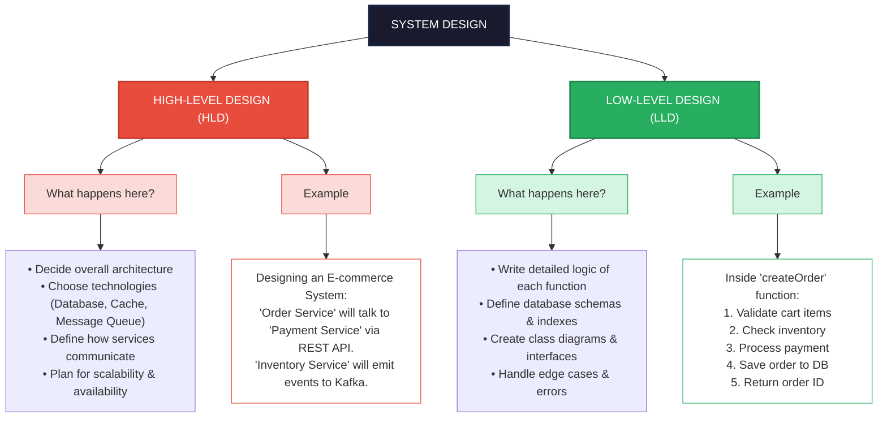

# System Design

## 1. Introduction to System Design

System Design is the process of defining the architecture, components, modules, interfaces, and data flow of a system to satisfy specified requirements. It bridges the gap between software requirements and actual implementation.

{/*  */}

## 2. Architecture Types

 - Monolithic Architecture
 - Microservices Architecture
 - Serverless Architecture
 - Event-Driven Architecture
 - Layered Architecture
 