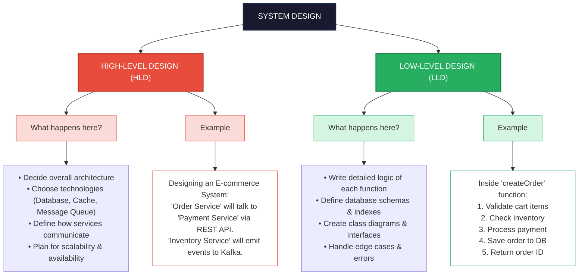
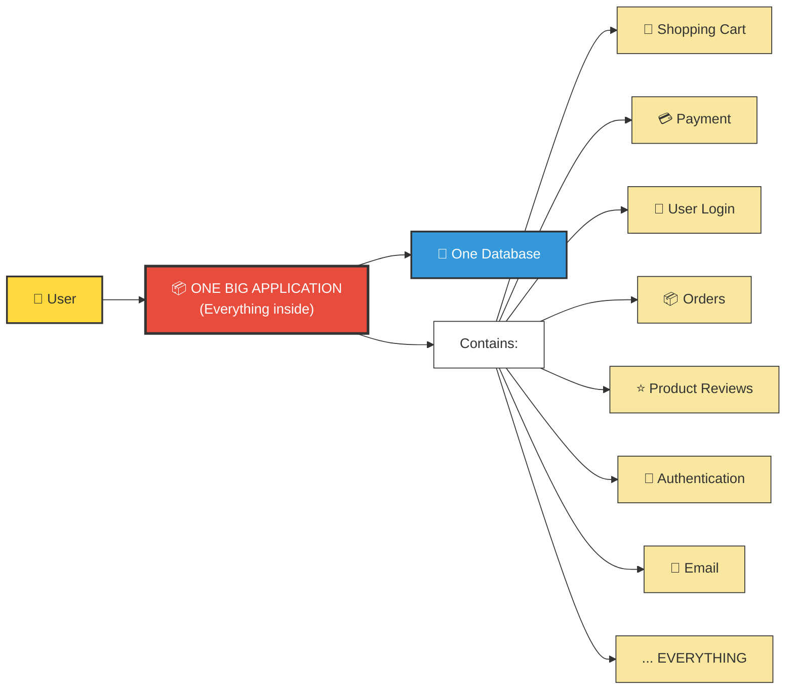
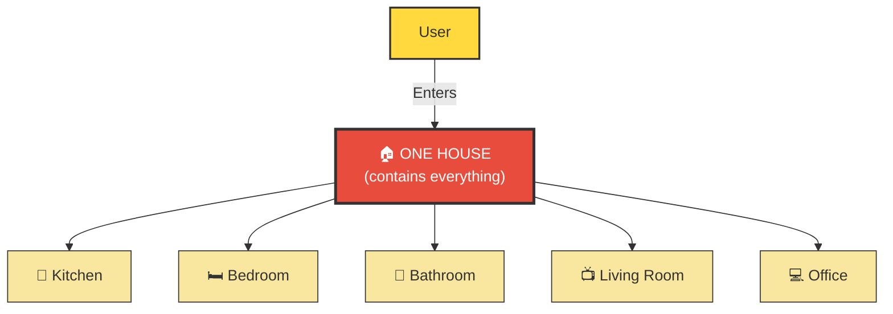
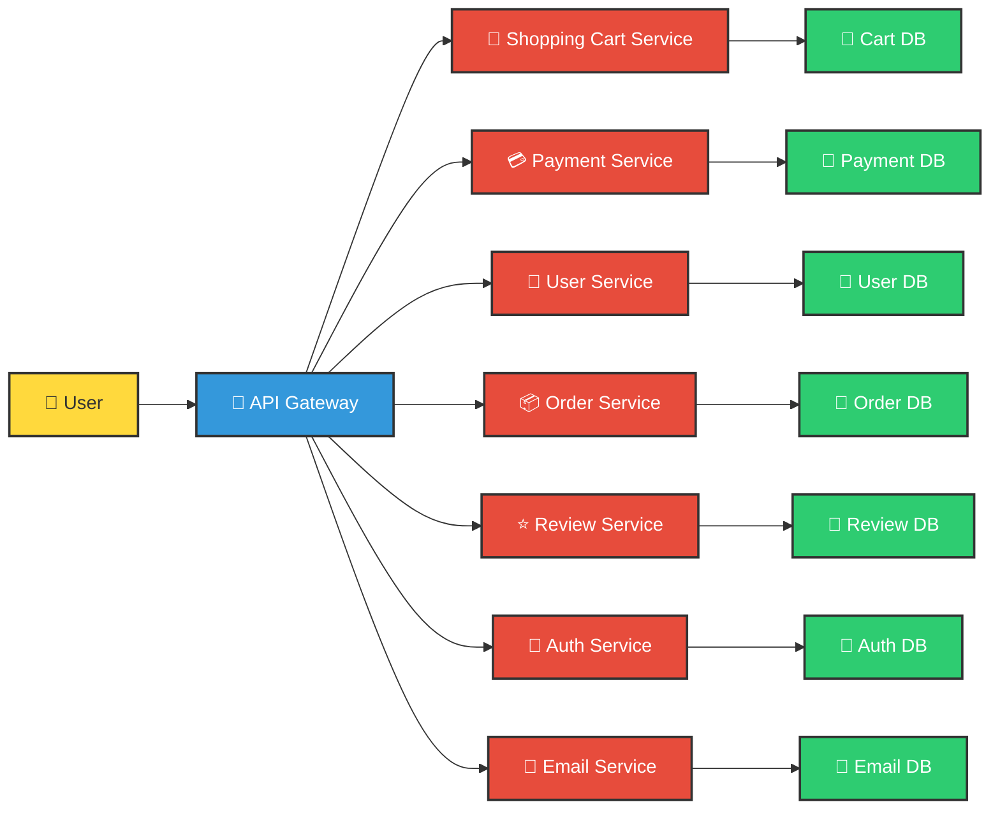
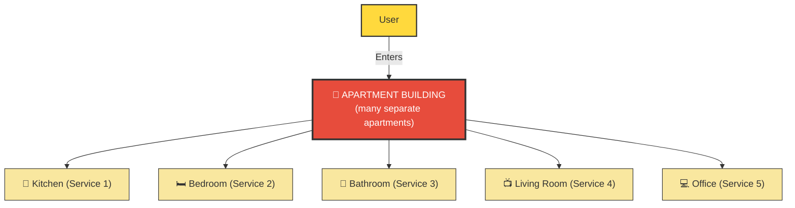

# System Design

## 1. Introduction to System Design

System Design is the process of defining the architecture, components, modules, interfaces, and data flow of a system to satisfy specified requirements. It bridges the gap between software requirements and actual implementation.

{/*  */}

## 2. Architecture Types

 - Monolithic Architecture
 - Microservices Architecture
 - Serverless Architecture
 - Event-Driven Architecture
 - Layered Architecture

### 2.1. Monolithic Architecture : 
 
 > In monolithic architecture, all components and functionalities of an application — frontend, backend, and data storage logic — are tightly coupled and deployed as a single unit. It is sometimes called a Centralized System.

 
 

#### Sample Architecture:   

 
 

 
 

#### Analogy:

 
 

### Advantages
   1. Simple to develop and understand — all code in one place
   2. Fewer network calls between modules (all in-process)
   3. Easier integration testing
   4. Simpler deployment — one artifact to build and ship
   5. Easier to secure — single network perimeter

### Disadvantages
   1. Difficult to scale — cannot scale individual components independently
   2. Slower development — codebase grows larger and more complex
   3. Tighter coupling — changes in one module can affect others
   4. Deployment challenges — entire application must be redeployed for any change
   5. Technology lock-in — difficult to adopt new technologies

 
 

### 2.2. Microservices Architecture :
 
 > Microservices is an evolved, more granular version of SOA where each service is completely independent — it has its own codebase, its own database, and its own deployment pipeline. Services communicate via lightweight APIs (REST, gRPC) or message queues.

 
 

#### Sample Architecture:   

 
 

 
 

#### Analogy:

 
 

### Advantages
   1. Scalability — can scale individual services independently
   2. Technology diversity — each service can use different technologies
   3. Fault isolation — failure in one service doesn't affect others
   4. Independent deployment — services can be deployed independently
   5. Easier maintenance — smaller codebases are easier to maintain

### Disadvantages
   1. Complexity — more complex to develop and manage
   2. Network latency — communication between services over network
   3. Data consistency — maintaining data consistency across services is challenging
   4. Testing complexity — integration testing is more complex
   5. Deployment complexity — more complex deployment process

### 2.3. Serverless Architecture :
 
 > Serverless doesn't mean “no servers.” It means you don’t manage servers. The cloud provider (AWS Lambda, Azure Functions, Google Cloud Functions) automatically provisions, scales, and manages the underlying infrastructure. You just upload code (functions), and the provider runs it on demand.

